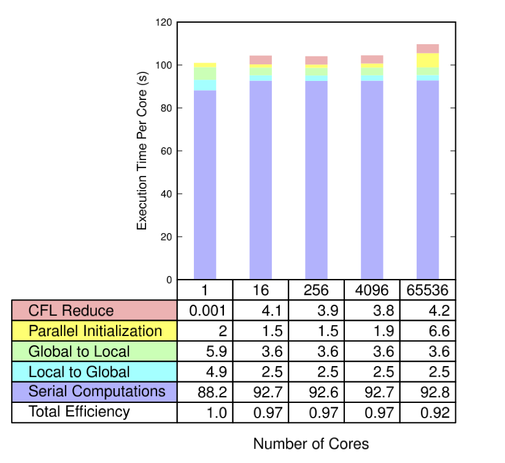

# Anatomy of PyClaw

## Motivation

* Complete example of modernizing a serial Fortran code for
  large-scale computing
* Start with Clawpack, a serial grid-based Fortran code
* Wrap legacy Fortran code using f2py
* Prototype, visualize, and test from Python
* Scale serial grid code using petsc4py

## Prototyping Example

(Live demo of PyClaw notebook)

## Clawpack Overview

* **C**onservation **L**aws **Pack**age:

    + General hyperbolic PDEs in 1/2/3 dimensions
* Developed by Randy LeVeque, Marsh Berger, and various others over the past 15 years in Fortran 77
* Dozens of “Riemann solvers” by numerous additional contributors
* Includes adaptive mesh refinement (AMRClaw)
* Textbook and many examples available
* Models tidal waves, storm surges, acoustic waves, and pyroclastic flows/surges
* Available at: www.clawpack.org

## Wrapping Clawpack with f2py

* We wrap at the hyperbolic solver level, Fortran code for
  advancing the solution on a grid by one time step
* The solver is generic over different physics, it accepts a pointer
  to a Fortran subroutine for computing the Riemann kernel at each
  interface
* We use f2py to wrap both the `step` subroutine and the `rp` Riemann
  kernel.  We don't call the Riemann kernel from Python, it is simply
  passed as an argument to the f2py-wrapped `step` function.

## Wrapping 1-D Wave Propagation Kernels with f2py

```
subroutine step1(num_eqn,num_waves,num_ghost,num_aux,mx,q,aux,dx, &
                 dt,method,mthlim,cfl,f,wave,s,amdq,apdq,dtdx,use_fwave,rp1)
```

We need to give f2py a little information about how we intend to use
the data to avoid making unnecessary copies.  We do this by adding
f2py directives after the function declaration. 

```
!f2py intent(in,out) q
!f2py intent(out) cfl
!f2py intent(in) num_eqn
!f2py intent(in) num_ghost
!f2py intent(in) mx
!f2py optional f, amdq, apdq, dtdx, s, wave
```
The variables `num_eqn`, `num_waves`, and `num_aux` are automatically inferred
from the dimensions of the input arrays.

## Wrapping 2-D Wave Propagation Kernels with f2py

The 2-D picture is only slightly more complicated:

```
subroutine step2(maxm,num_eqn,num_waves,num_aux,num_ghost,mx,my, &
qold,qnew,aux,dx,dy,dt,method,mthlim,cfl, &
qadd,fadd,gadd,q1d,dtdx1d,dtdy1d, &
aux1,aux2,aux3,work,mwork,use_fwave,rpn2,rpt2)
```

Note that we're being slightly less verbose here, only explicitly
specifying the output variable `cfl` as well as the modified array `qnew`.

```
!f2py intent(out) cfl
!f2py intent(in,out) qnew
!f2py optional q1d, qadd, fadd, gadd, dtdx1d, dtdy1d
```

## Wrapping Riemann Fortran Kernels as Function Pointers with f2py

```
subroutine rp1(maxm,meqn,mwaves,mbc,mx,ql,qr,auxl,auxr, &
               wave,s,amdq,apdq,num_aux)
```

The function pointer is wrapped as-is!

## Calling f2py-Wrapped Wave Propagation Kernels from Python

Here's the original Fortran interface:

```
subroutine step1(num_eqn,num_waves,num_ghost,num_aux,mx,q,aux,dx, &
                 dt,method,mthlim,cfl,f,wave,s,amdq,apdq,dtdx,use_fwave,rp1)
```

Here's the function call from Python.

```
rp1 = self.rp.rp1._cpointer
self.qbc,cfl = self.fmod.step1(num_ghost,mx,self.qbc,self.auxbc,dx,
	           dt,self._method,self._mthlim,self.fwave,rp1)
```

## Enabling Grid-Based Parallelism with PETSc DMDA

* Grid-based serial solver operates on a grid augmented by "ghost
  cells"
* Exact same concept used by PETSc DMDA
    + each process is responsible for one grid, exchanges boundary
      information with neighbors
* Changes to PyClaw (Less than 100 LOC):
    + Store grid data in DMDA instead of NumPy array
	+ Calculate global CFL condition by reduction 
	+ Update neighbor information after successful time steps

## PyClaw Architecture


## Scaling 



## Verification and Validation

* Code is prototyped and verified from Python scripts
* Validated against Clawpack
    + which in turn has been validated against other codes and models
* Verified by developers before commits
* Also verified continuously by Travis CI on GitHub
